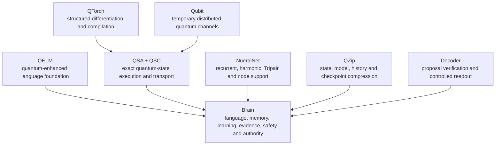

<p align="center">
  
</p>

<h1 align="center">R&D BioTech Alaska</h1>

<p align="center">
  <strong>Open science, quantum computing, artificial intelligence, biology, and practical research from Eagle River, Alaska.</strong>
</p>

<p align="center">
  <a href="https://www.rdbiotech.org">
    
  </a>
  <a href="https://www.qelm.org">
    
  </a>
  <a href="https://github.com/sponsors/R-D-BioTech-Alaska">
    
  </a>
</p>

<p align="center">
  
  
  
  <a href="https://discord.gg/sr9QBj3k36">
    
  </a>
</p>

---

<h2 align="center">About R&D BioTech Alaska</h2>

<p align="center"><strong>R&D BioTech Alaska is a 501(c)(3) nonprofit research organization based in Eagle River, Alaska.</strong></p>

We build scientific software, experimental research systems, public learning resources, and practical prototypes. The work crosses fields on purpose. Quantum information, artificial intelligence, biology, chemistry, physics, materials, hardware, and software are often treated as separate areas even when the useful answer sits between them.

<p align="center"><strong>Our main goals are straightforward:</strong></p>

<p align="center">
  Build systems that solve real technical problems.<br>
  Publish enough of the work for other people to inspect and challenge it.<br>
  Separate measured results from ideas that are still being tested.<br>
  Make advanced science usable outside of large companies and institutions.<br>
  Support education, community access, and independent research.<br>
  Keep the work local, reproducible, and under human control.
</p>

The organization is founded and led by **Brenton Carter**, a quantitative biologist and quantum systems developer.

<p align="center">
  <a href="https://orcid.org/0009-0007-8183-1111">
    
  </a>
</p>

---

<h1 align="center">Primary research direction</h1>

<h2 align="center">Brain, QELM, and Qubit State Algebra</h2>

<p align="center">The largest connected research program at R&D BioTech Alaska is <strong>Brain</strong>.</p>

Brain grew from **QELM**, the Quantum-Enhanced Language Model. QELM began as a direct attempt to use quantum channels, trainable circuits, amplitude, phase, sub-bit states, entanglement, and hybrid quantum-classical processing inside a language model.

As the work progressed, the problem became larger than language generation.

<p align="center"><strong>A persistent system also needs:</strong></p>

<p align="center">
  Working, episodic, semantic, and procedural memory.<br>
  Continual learning and later consolidation.<br>
  Evidence and truth handling.<br>
  Model lineage and rollback.<br>
  Safety and action boundaries.<br>
  Internal coordination.<br>
  Distributed temporary computation.<br>
  A reliable distinction between an experiment and an accepted improvement.
</p>

<p align="center">That larger system became <strong>Brain</strong>.</p>

<p align="center">Brain then created the need for <strong>Qubit State Algebra (QSA)</strong>.</p>

QSA was built because Brain needed a native quantum-state engine that could run exactly on ordinary CPUs and GPUs, preserve structured states instead of flattening everything into one global statevector, save and restore state, support distributed temporary channels, and remain under direct control of the project.

<p align="center">The relationship is:</p>

```text
QELM
  ↓
quantum-enhanced language, channels, phase, sub-bit states, training
  ↓
Brain
  ↓
memory, learning, evidence, safety, authority, rollback
  ↓
QSA
  ↓
native exact quantum-state execution for Brain and the wider system
```

<p align="center">Physical quantum hardware can be used where appropriate, but it is not required for the architecture to operate. The system is intentionally quantum-classical:</p>

```text
Quantum-state mathematics
phase · amplitude · interference · entanglement · observables
                         ⇅
Classical computation
memory · control · optimization · storage · training · execution
```

<p align="center">The goal is not to replace classical computing with quantum computing.</p>

<p align="center">The goal is to let each side do the work it is better at.</p>

---

<h2 align="center">Current system map</h2>



<p align="center">Brain remains the controlling system. The surrounding projects provide specialized work without independently owning language, memory, truth, identity, model promotion, or final action authority.</p>

---

<h1 align="center">Main projects</h1>

<table>
<tr>
<td width="50%" valign="top" align="center">

<h2 align="center"><a href="https://github.com/R-D-BioTech-Alaska/QSA">Qubit State Algebra</a></h2>

<p align="center"><strong>Public · Active</strong></p>

<p align="center">QSA is a from-scratch C++20 runtime for exact, structure-aware quantum-state execution on ordinary computers.</p>

It keeps independent parts of a quantum state independent, merges only the components that interact, recovers separability when possible, and uses specialized exact representations when the state has stronger mathematical structure.

Current systems include:

- geometric Bloch-cell qubits;
- sparse and dense local components;
- exact factor and separability recovery;
- symmetry states;
- compressed Grover states;
- stabilizer tableaus;
- phase-graph states;
- quantum-dot pockets;
- compiled plans;
- QSC checksummed state storage;
- C++, C, and Python interfaces.

[](https://github.com/R-D-BioTech-Alaska/QSA)
[](https://github.com/R-D-BioTech-Alaska/QSA/actions/workflows/qsa.yml)

</td>
<td width="50%" valign="top" align="center">

<h2 align="center"><a href="https://github.com/R-D-BioTech-Alaska/Qelm">QELM</a></h2>

<p align="center"><strong>Public · Active</strong></p>

<p align="center">QELM is the original quantum-enhanced language-model framework and the research foundation that led to Brain.</p>

The public implementation includes:

- token embeddings and next-token learning;
- trainable quantum attention and feed-forward paths;
- amplitude and phase features;
- sub-bit encoding;
- entanglement and data re-uploading;
- parameter-shift and SPSA training;
- local, Aer, and IBM Runtime paths;
- model files, token maps, trainer, and chat interface.

QELM is not presented as a replacement for modern production LLMs. It is a research architecture built to test whether quantum-state information can participate directly in language processing.

[](https://github.com/R-D-BioTech-Alaska/Qelm)
[](https://pypi.org/project/qelm/)

</td>
</tr>

<tr>
<td width="50%" valign="top" align="center">

<h2 align="center">Brain</h2>

<p align="center"><strong>Private for now · Active</strong></p>

<p align="center">Brain is the central cognitive architecture that grew from QELM.</p>

It is being built around:

- language and reasoning;
- persistent memory;
- continual learning;
- offline consolidation;
- evidence and truth handling;
- canonical behavior preservation;
- reversible model improvement;
- QSA-backed quantum-state processing;
- governed integration of the surrounding systems.

<p align="center">The active repository is private while the source, evaluation material, checkpoints, and release boundaries are prepared.</p>

<p align="center">A previous public Brain concept repository remains available for historical context:</p>

<p align="center"><a href="https://github.com/R-D-BioTech-Alaska/Brain">Public Brain repository</a></p>

</td>
<td width="50%" valign="top" align="center">

<h2 align="center"><a href="https://github.com/R-D-BioTech-Alaska/Qubit">Qubit</a></h2>

<p align="center"><strong>Public · Active</strong></p>

<p align="center">Qubit is the distributed temporary-channel side of the architecture.</p>

A Qubit node may run on a phone, tablet, computer, or server. It receives a bounded state-only job, performs authorized logical quantum work, returns a result and evidence, then resets or destroys its temporary state.

The design intentionally prevents nodes from owning or retaining:

- user information;
- conversation history;
- permanent model memory;
- private documents;
- independent Brain identity;
- model-promotion authority.

[](https://github.com/R-D-BioTech-Alaska/Qubit)

</td>
</tr>
</table>

---

<h2 align="center">Active private research</h2>

<p align="center">These repositories exist and are under active development. They remain private for now while implementation, validation, documentation, and release boundaries are completed.</p>

| Project | Role |
| :---: | :---: |
| **BrainQ** | Current Brain integration, training, memory, evidence, safety, evaluation, adoption, and rollback |
| **NueralNet** | Subordinate recurrent, harmonic, Tripair, logical-Neuron, and distributed support fabric |
| **QTorch** | Structure-aware quantum training, differentiation, compilation, and PyTorch interoperability |
| **QZip** | Exact structural compression for quantum states, tensors, checkpoints, histories, and Brain archives |
| **Decoder** | Proposal verification, proof-carrying readout, and controlled decoding without execution authority |

<p align="center"><strong>Private does not mean inactive.</strong><br>It means the work is not ready to be represented publicly as a finished release.</p>

---

<h1 align="center">Measured results</h1>

<p align="center"><strong>We separate measured results from architecture plans and untested hypotheses.</strong></p>

<h2 align="center">QSA validation and structured-state results</h2>

| Measurement | Result |
| :---: | :---: |
| Independent differential validation | **14,400 randomized gate operations passed** |
| Global-phase-invariant fidelity tolerance | **2 × 10⁻¹⁰** |
| Independent product register | **10,000 qubits in 1.03 MiB** |
| Independent Bell pairs | **100 pairs in 25.88 KiB** |
| Exact GHZ state | **50 qubits in 5.60 KiB** |
| Compressed 16-qubit Grover path | **160,665.80× faster than the dense exact path** |
| 20-qubit symmetry fast-forward | **130,750.18× faster than dense** |
| Disconnected SWAP across dense 12-qubit components | **approximately 745,000× faster** |
| 18-qubit, 800-gate stabilizer workload | **approximately 1,744× faster** |

<p align="center">These are exact, workload-specific measurements against the stated dense or ordinary QSA path. They are not one universal multiplier and do not remove the exponential worst case for arbitrary highly entangled states.</p>

<h2 align="center">Controlled QSA result inside AI</h2>

<p align="center"><strong>A controlled support experiment used:</strong></p>

<p align="center">
  An immutable trained parent.<br>
  Exact no-op initialization.<br>
  The same input channels and residual geometry.<br>
  <strong>10,945 trainable parameters in each trainable arm.</strong><br>
  A parameter-matched conventional control.<br>
  Full autoregressive evaluation.<br>
  Sealed holdout evaluation.<br>
  Protected-parent and native-resource checks.
</p>

| Evaluation | Frozen parent | Conventional control | Hybrid QSA |
| :---: | :---: | :---: | :---: |
| Development quality | 88.46% | 88.46% | **89.23%** |
| Sealed holdout quality | 88.46% | 88.46% | **89.23%** |
| Holdout instruction compliance | 80.77% | 80.77% | **84.62%** |
| Holdout max-token termination | 3.85% | 3.85% | **1.54%** |
| Holdout language cross-entropy | 4.50917 | 4.50917 | **4.50836** |

<p align="center">This is a bounded positive result. It does not establish universal quantum advantage or prove that every QSA mechanism improves every AI task.</p>

<h2 align="center">Brain and QELM language development</h2>

<p align="center">A later sealed QELM language phase completed <strong>24,576 optimizer steps</strong> and produced:</p>

<p align="center">
  <strong>16.52% lower broad cross-entropy</strong><br>
  <strong>36.43% lower perplexity</strong><br>
  <strong>+7.4969 percentage points exact-token match</strong><br>
  <strong>314,442 additional correct development tokens</strong><br>
  Improved canonical behavior.<br>
  Improved structured safety.<br>
  Zero nonfinite events.<br>
  Zero forbidden marker collisions.
</p>

<p align="center">Native QSA and Tripair were disabled during that phase, so these results demonstrate QELM and Brain language-development progress rather than quantum attribution.</p>

<h2 align="center">QZip verified compression results</h2>

QZip is private for now, but verified exact round-trip results include:

| Workload | QZip | 7-Zip | Result |
| :---: | :---: | :---: | :---: |
| QSC state family | 342,712 B | 549,659 B | **37.7% smaller than 7-Zip** |
| Related checkpoint family | 2,098,392 B | 2,099,735 B | Narrow QZip win |
| Canterbury corpus | 425,441 B | 483,667 B | **58,226 B smaller** |
| Silesia six-file pilot | 14,859,541 B | 15,716,478 B | **856,937 B smaller** |

<p align="center">Each accepted comparison used integrity testing, extraction, and byte-for-byte verification. Compression speed remains a known weakness, and highly structured experimental fixtures are reported separately from ordinary-file corpus results.</p>

---

<h1 align="center">Broader science and engineering</h1>

<p align="center">Quantum computing is the largest current software program, but it is not the only work at R&D BioTech Alaska.</p>

<table>
<tr>
<td width="50%" valign="top" align="center">

<h2 align="center">Biology and scientific modeling</h2>

### [OncoForge](https://www.rdbiotech.org/oncoforge/)

A conceptual cancer and healthy-cell simulation environment for hypothesis generation, signal review, experiment comparison, and report export.

OncoForge is not a medical product, clinical predictor, treatment recommendation system, or substitute for medical care.

### Plant AI

Plant identification, disease review, environmental context, and watering or feeding schedule support.

[Plant repository](https://github.com/R-D-BioTech-Alaska/Plant)

### Zophobas morio research

A research direction involving superworm gut biology, polystyrene degradation, microbiology, enzyme questions, and polymer-waste concepts.

</td>
<td width="50%" valign="top" align="center">

<h2 align="center">Materials and field research</h2>

### Hydrophobic materials

Economic extraction, reconstruction, and testing of natural and synthetic hydrophobic surfaces and coatings.

### Natural fruit covering

Washable or potentially edible fruit-coating concepts intended to reduce spoilage, with food-contact safety and controlled shelf-life testing treated as required boundaries.

### Non-freezing concrete

Conceptual winter-material research involving freeze damage, surface behavior, snow, and ice. It is not presented as certified structural or roadway material.

### Alaska field notes

Practical observations involving plants, winter systems, materials, greenhouse environments, local ecology, and real-world equipment.

</td>
</tr>

<tr>
<td width="50%" valign="top" align="center">

<h2 align="center">Lab and education</h2>

- microscopy review;
- 3D printing;
- enzyme and molecular learning;
- research scoping;
- scientific explainers;
- project records;
- educational material;
- youth learning and mentorship;
- community science access.

</td>
<td width="50%" valign="top" align="center">

<h2 align="center">Developer and hardware tools</h2>

- [Gitzilla](https://github.com/R-D-BioTech-Alaska/Gitzilla) — GUI-based Git and large-file workflow support;
- [Wizpr-Suite](https://github.com/R-D-BioTech-Alaska/Wizpr-Suite) — user-controlled AI-ring and assistant connectivity;
- [SciOS](https://github.com/R-D-BioTech-Alaska/SciOS) — scientific operating-system research;
- [Sonic](https://github.com/R-D-BioTech-Alaska/Sonic) — ultrasonic hardware and control experiments;
- [BLE](https://github.com/R-D-BioTech-Alaska/BLE) — Bluetooth communication tooling;
- [WIC-Reset](https://github.com/R-D-BioTech-Alaska/WIC-Reset) — practical printer-maintenance software.

</td>
</tr>
</table>

A fuller project catalog is available at [RDBioTech.org/projects](https://www.rdbiotech.org/projects/).

---

<h1 align="center">Research principles</h1>

<p align="center">Our project descriptions are intentionally specific about what has and has not been established.</p>

<p align="center">
  **Measured results, implemented architecture, informed inference, and untested hypotheses are kept separate.**<br>
  **Exact and approximate methods are labeled separately.**<br>
  **Structured-state gains are not generalized to arbitrary states.**<br>
  **Physical QPUs, exact classical quantum-state execution, and quantum-inspired methods are not treated as interchangeable.**<br>
  **A passing workflow is infrastructure evidence, not automatically a capability gain.**<br>
  **AI controls should match active trainable capacity, data, evaluation, and budget wherever possible.**<br>
  **New Brain mechanisms begin at exact no-op when the architecture allows it.**<br>
  **Accepted checkpoints remain recoverable and protected.**<br>
  **Negative, neutral, and failed experiments remain part of the evidence record.**<br>
  **Privacy is part of the architecture, especially for distributed nodes.**<br>
  **Claims follow the actual test, not the intended outcome.**
</p>

<p align="center"><em>Different repositories use different licenses. Check each repository before use, modification, redistribution, or commercial deployment.</em></p>

---

<h1 align="center">Publications</h1>

<h2 align="center">Qubit State Algebra</h2>

<p align="center"><strong>Qubit State Algebra: An Adaptive Component-Based Representation for Exact Pure-State Quantum Simulation on Classical Hardware</strong></p>

<p align="center">[](https://doi.org/10.13140/RG.2.2.19653.20965)</p>

The paper describes QSA's adaptive component representation, local sparse and dense state patches, separability recovery, QSC storage, validation, and structured-state measurements.

<h2 align="center">Quantum-Enhanced Language Model</h2>

<p align="center"><strong>Quantum-Enhanced Language Model: Bridging Quantum Computing and Classical Machine Learning for Advanced NLP</strong></p>

<p align="center">[](https://doi.org/10.13140/RG.2.2.11844.90243)</p>

The paper describes QELM's quantum channels, state encoding, transformer-style language path, optimization methods, hardware considerations, and original research direction.

---

<h1 align="center">Work with us</h1>

<p align="center">R&D BioTech Alaska welcomes serious technical discussion, independent replication, research collaboration, code review, documentation work, and support for public scientific development.</p>

<p align="center"><strong>Areas where outside work is especially useful include:</strong></p>

<p align="center">
  exact quantum-state factorization;<br>
  sparse, dense, tensor-network, and decision-diagram interoperability;<br>
  stabilizer, symmetry, phase-graph, and quantum-dot methods;<br>
  differentiable quantum execution;<br>
  C++ performance, SIMD, CUDA, and multicore scheduling;<br>
  formal verification and serialization safety;<br>
  controlled AI ablations and matched baselines;<br>
  exact scientific compression;<br>
  distributed privacy-preserving computation;<br>
  computational biology and scientific simulation;<br>
  microscopy, materials, plant science, and field-study design;<br>
  reproducible documentation and independent benchmark review.
</p>

<p align="center"><strong>The most useful contributions are specific:</strong></p>

<p align="center">
  1. Reproduce a result.<br>
  2. Record the exact environment and version.<br>
  3. Report what matched and what did not.<br>
  4. Include tests or evidence.<br>
  5. Separate a defect from a disagreement about interpretation.
</p>

---

<h1 align="center">Support the research</h1>

<p align="center"><strong>R&D BioTech Alaska is a nonprofit. Funding supports:</strong></p>

<p align="center">
  Research hardware and compute.<br>
  Public software releases.<br>
  Independent validation.<br>
  Scientific equipment.<br>
  Documentation and education.<br>
  Community-access projects.<br>
  Developer and research time.
</p>

<p align="center">
  <a href="https://github.com/sponsors/R-D-BioTech-Alaska">
    
  </a>
  <a href="https://www.rdbiotech.org/support/">
    
  </a>
</p>

<p align="center">Research groups, universities, developers, funders, and organizations interested in independent validation or collaboration can contact us directly.</p>

---

<h1 align="center">Connect</h1>

<p align="center">
  <strong>Website:</strong> <a href="https://www.rdbiotech.org">RDBioTech.org</a><br>
  <strong>QELM:</strong> <a href="https://www.qelm.org">Qelm.org</a><br>
  <strong>GitHub:</strong> <a href="https://github.com/R-D-BioTech-Alaska">R-D-BioTech-Alaska</a><br>
  <strong>Founder:</strong> <a href="https://github.com/Inserian">Brenton Carter / Inserian</a><br>
  <strong>ORCID:</strong> <a href="https://orcid.org/0009-0007-8183-1111">0009-0007-8183-1111</a><br>
  <strong>Discord:</strong> <a href="https://discord.gg/sr9QBj3k36">Join the research community</a><br>
  <strong>Email:</strong> <a href="mailto:contact@rdbiotechalaska.com">contact@rdbiotechalaska.com</a><br>
  <strong>QELM email:</strong> <a href="mailto:contact@qelm.org">contact@qelm.org</a><br>
  <strong>Facebook:</strong> <a href="https://www.facebook.com/groups/RandDBioTechAlaska">R&D BioTech Alaska group</a>
</p>

---
